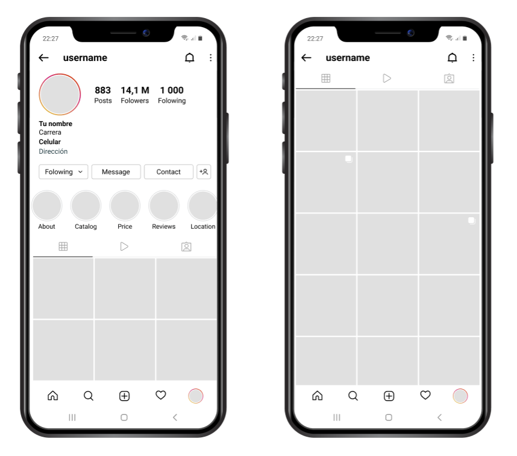

# Parcial 2

1. Realizar el siguiente diseño en figma.

> Se tiene que usar el `Frame (Phone)`.

2. En el repositorio compartido que se tiene crear su rama con su nombre y apellido, ejemplo : `juan.perez`
3. Crear un archivo txt y pegar el enlace de presentación del diseño Figma.
4. Realizar respectivo merge en GitHub para que se pueda visualizar en la rama `upc`.
